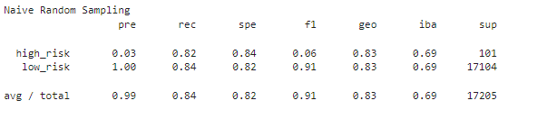
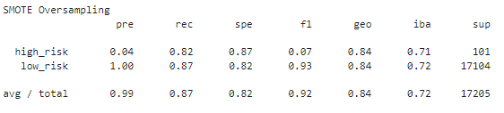
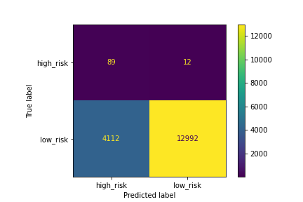
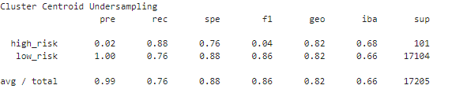
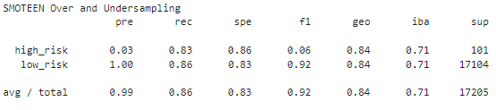
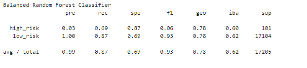
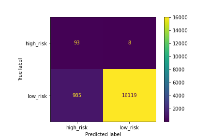
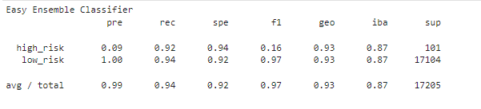

# Credit_Risk_Analysis
Module 17 Challenge

## Overview

Jill would like for us to evaluate several models to see if we can find one that can accurately identify if a loan to a customer would be in risk of default or not.

Credit risk is an inherently unbalanced classification problem, as good loans easily outnumber risky loans. Because of this Jill asked me to employ different techniques to train and evaluate models with unbalanced classes. Jill asked me to use imbalanced-learn and scikit-learn libraries to build and evaluate models using resampling.

Using the credit card credit dataset from LendingClub, a peer-to-peer lending services company, I have been requested to oversample the data using the RandomOverSampler and SMOTE algorithms, and undersample the data using the ClusterCentroids algorithm. Then, I'll need to try a combined approached of over- and undersampling using the SMOTEEN algorithm. Next, I'll compare two new machine learning models that reduce bias, BalancedRandomForestClassifier and EasyEnsembleClassifier, to predict credit risk. 

## Purpose

To complete this task, I will use skills learned in this module regarding Supervised Machine learning.  I'll use imbalanced-learn libraries, scikit-learn libraries, Jupyter Notebook and Python to test out several algorithms and models such as :
  * RandomOverSampler
  * SMOTE
  * ClusterCentroids
  * SMOTEEN
  * BalancedRandomForestClassifier
  * EasyEnsembleClassifier

### Deliverable 1

#### Random Over Sampling - Naive RandomOverSampler

  * An accuracy score for the model is **0.8325468421491353**
  
  * A confusion matrix has been generated
  
  
  
  * An imbalanced classification report has been generated
  
  
  
#### Oversampling - SMOTE

  * An accuracy score for the model is **0.8440938486973113**
  
  * A confusion matrix has been generated
  
  
  
  * An imbalanced classification report has been generated
  
  

#### Undersampling - ClusterCentroids

  * An accuracy score for the model is **0.8203882595930314**
  
  * A confusion matrix has been generated
  
  
  
  * An imbalanced classification report has been generated
  
  
  
### Deliverable 2

#### Combination of (Over and Under) Sampling - SMOTEEN 

  * An accuracy score for the model is **0.844016280135965**
  
  * A confusion matrix has been generated
  
  
  
  * An imbalanced classification report has been generated
  
  
 
### Deliverable 3

#### Ensemble Learners - Balanced Random Forest Classifier

  * An accuracy score for the model is **0.7837130912576757**
  
  * A confusion matrix has been generated
  
  
  
  * An imbalanced classification report has been generated
  
  
  
  * The features are sorted in descending order by feature importance

#### Easy Ensemble Classifier

  * An accuracy score for the model is **0.931601605553446**
  
  * A confusion matrix has been generated
  
  
  
  * An imbalanced classification report has been generated
  
  
  
  ## Analysis Summary
  
Because each model appeared the be sufficient at identifying low-risk loans, I created the table below consolidating the imbalanced summary reports of each models high-risk loan results. 
  
| Model          | Precision      | Recall         | F1
| ---------------| ---------------| ---------------| ---------------
| RandomOverSamp | .03  | .82 |.06
| Smote | .04 | .82 |.07
|ClusterCentroids |.02|.88 |.04
|SMOTEEN |.03|.83 |.06
|BalancedRandomForest |.03|.69 |.06
|SMOTEEN |.09|.94 |.16

As I mentioned above, all of the resampling models did a sufficient job of identifying loans that are considered low-risk status.  However the models struggled with identifying potentials loans that are considered high-risk. Meaning, the models struggled identifying loans that were high-risk of being paid late, or that were fraudulent or that could fall into default.  None of the resampling models provided improvment as each had a low f1 score and low precision results that ranged from .04 to .06.  The ensemble models, particularly SMOTEEN proved to be slightly better in identifying high-risk loans.  Their precision score, recall score, and f1 score were better than the resampling models.  The SMOTEEN f1 score of 16 is by far better than all of the resampling f1 scores but, .16 is still not ideal.

If one has to move forward with one of these models, then the SMOTEEN would be the recommendation.  However, if more time is avaiable, perhaps going back to the dataset and reshaping the data by identifying columns that are not deemed as important to the decision making process or model creation process and remove them.  This may allow greater weight to fall upon the key components necessary to identify high-risk loans and potentialy improve the accuracy of the models.
